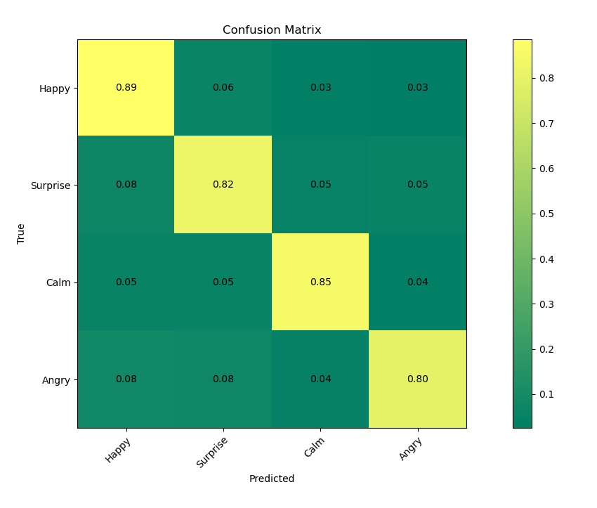

# Emotion Adaptation to User Interfaces
This project is based on an experiment where we collect facial expressions of users while interacting with specific UI designs, aiming to elicit four emotions: **Happy**, **Surprise**, **Calm**, and **Angry**. The goal of this project is to adapt user interfaces based on these emotional states, improving user experience and interaction. Below is an overview of the experimental workflow and how we processed the data.

## Project Overview

The project follows these steps:

1. **Facial Expression Collection**: We recorded the facial expressions of users while they interacted with a specific UI design intended to elicit four primary emotions (Happy, Surprise, Calm, Angry).

2. **Data Processing**: 
   - The facial expression videos were captured and stored.
   - We extracted frames from the videos and trimmed them to focus on the sections where users interacted with the UI, particularly during specific emotional triggers.

3. **Model Training & Testing**:
   - The processed data was split into training, testing, and validation sets.
   - A model was trained to classify the emotions based on facial expressions.
   - The trained model was then tested in real-time to detect the emotions while users interact with the interface.

## Architecture

Below is the architecture of the project that outlines the steps involved in processing the data and training the model.


## Workflow

### 1. **Recording Facial Expressions**:
   - The **`recorder.py`** file is used to record video data of facial expressions during user interaction with the UI.
   - The script captures facial expressions and stores them in video files for further processing.

### 2. **Trimming Video**:
   - The **`trim.py`** file is used to trim the videos, extracting only the portions where the user is interacting with the UI within specific time frames.
   - This ensures that irrelevant video sections are excluded from the analysis.

### 3. **Extracting Frames**:
   - The **`extract_frame.py`** file is used to extract frames from the trimmed video.
   - These frames serve as input for training and testing the model.

### 4. **Data Splitting**:
   - The **`create_train_test_and_val_sets.py`** file is used to split the extracted frames into training, validation, and test sets.
   - This ensures that the model has diverse data to learn from and is evaluated fairly.

### 5. **Model Training**:
   - The **`only_vid_classifier.py`** file is used to train the model on the collected data.
   - This script trains a classifier to recognize the four emotions based on the facial expression frames.

### 6. **Real-time Testing**:
   - The **`test_realtime.py`** file is used to test the trained model in real-time.
   - This script takes live input from the user’s facial expressions and classifies their emotions based on the trained model.

## Results

Below is the confusion matrix representing the results of the model’s classification performance:




## Citation

If you use this project or its methods in your work, please cite the following paper:

```bibtex
@article{Haddad2024,
    title={Emotion-Aware Interfaces: Empirical Methods for Adaptive User Interface.},
    author={Haddad Syrine, Olfa Daassi, Safya Belghith},
    journal={8th International Conference on Computer-Human Interaction Research and Applications (CHIRA24)},
    year={2024},
    publisher={Springer}
}
